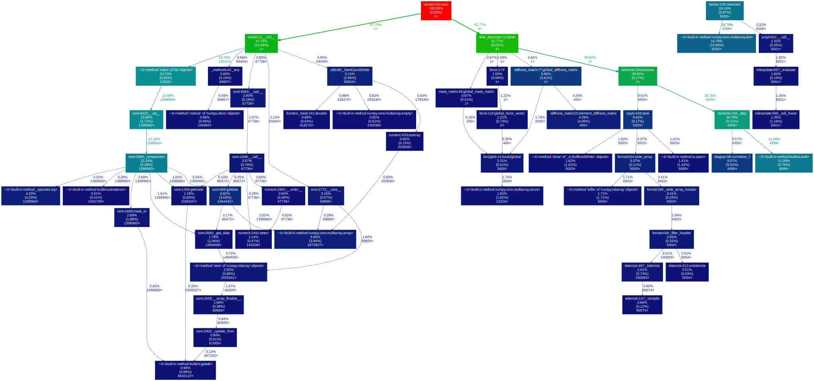

Profiling
---------

Profiling can be done using the ``bash`` script in Profiling. 
It has to be run from the main directory (``VERSEM/``) as

::

    bash$ ./profiling/profiling_versem.sh

After the program is done, a vector filed called ``profiled_graph.svg`` 
will be output in the ``profiling/`` directory.

        A sample profiling graph output from 
